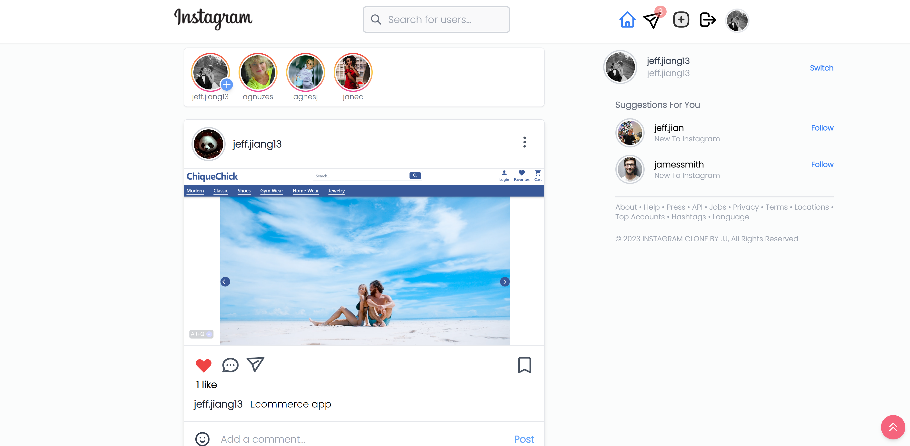

<div align="center" id="top" className="mb-10">


&#xa0;

  

<a href="https://jj-ig.vercel.app">Demo</a>

</div>

<h1 align="center">Instagram Clone</h1>
<p>
  
  
  
</p>

### About The Build:

The IG App 2023 is a comprehensive clone of the Instagram platform, designed to replicate the core functionalities and visual appeal of the original app with added enhancements. Developed using modern web technologies such as Vite, React.js, and Tailwind CSS, this project emphasizes a responsive and eye-catching user interface, ensuring optimal performance and user experience across various devices, specifically optimized for screens with a minimum width of 375px.

### Key Features Include:
- **Authentication:** Supports login with Facebook, as well as login and signup with validation.
- **User Interaction:** Users can follow and unfollow others, post images and videos, and interact through comments and likes, including a double-tap like feature with animation.
- **Social Features:** The app offers suggestions for users to follow, a comprehensive profile page, a default profile image for new users, and a search functionality with a modal for user discovery.
- **Engagement Tools:** Responsive popup modals for likes, followings, followers, and user detail editing. Users can update their profile details and images, and view photos in popup modals on the profile page.
- **Content Management:** Post deletion functionality for the content owner.
- **Messaging:** One-to-one private messaging with support for media (images, videos), audio, voice recording, and sending. It also includes features for grouping messages by date and displaying the last active status of users.
- **Security and Usability:** The app implements protected routes and displays a progress bar during route changes for a better user experience.


<br />

Current Features :
<li>LogIn with Facebook</li>
<li>LogIn and SignUp with Validation</li>
<li>Following and Unfollowing Users</li>
<li>Posting Images and videos</li>
<li>Comment Functionality</li>
<li>Adding Emojis in Comments</li>
<li>Like Functionality on both Posts and Comments</li>
<li>Double Tap Like Functionality with Slick Animation on Posts</li>
<li>Getting Suggestions to Follow Users</li>
<li>Profile Page with User data</li>
<li>Default Profile Image to every User on SignUp</li>
<li>SearchBar Modal with User Search Functionality</li>
<li>Responsive Popup Modals for: Likes, Followings, Followers, UserEdit Details </li>
<li>Updating Profile Deatils and Image</li>
<li>Photo Popup Modal in Profile Page</li>
<li>Delete Post functionality for the Owner</li>
<li>One to One Private Messaging functionality with Users in Following</li>
<li>Media(Image, Video), Audio Sending support in Private Messages</li>
<li>Voice Recording and Sending in Private Messages</li>
<li>Grouping Messages According to Date</li>
<li>Last Active Status of Users in Message</li>
<li>Protected Routes</li>
<li>Progress Bar on Route Change</li>
<br/>

## Vite + React.js + Tailwind CSS

Vite is a build tool that aims to provide a faster and leaner development experience for modern web projects.

## How To Start :

### Install Vite and create React project:

Execute [`vite`](https://vitejs.dev/guide/#scaffolding-your-first-vite-project) with [npm](https://docs.npmjs.com/cli/init) or [Yarn](https://yarnpkg.com/lang/en/docs/cli/create/) to bootstrap the example:

```bash
npm init vite@latest
# or
yarn create vite
```

Then follow the prompts and make your choices.
Now execute the following commands:

```bash
cd my-project

npm install
```

### Install and setup Tailwind CSS:

To install [`tailwindcss`](https://tailwindcss.com/docs/installation/using-postcss) and its peer dependencies via `npm`, and create your `tailwind.config.js` file, execute the following commands:

```bash
npm install -D tailwindcss postcss autoprefixer
npx tailwindcss init
```

### Add Tailwind to your PostCSS configuration

Add `tailwindcss` and `autoprefixer` to your `postcss.config.js` file, or wherever PostCSS is configured in your project.

```bash
module.exports = {
  plugins: {
    tailwindcss: {},
    autoprefixer: {},
  }
}
```

### Configure your Template paths

Add the paths to all of your template files in your `tailwind.config.js` file.

```bash
module.exports = {
  content: [
    "./index.html",
    "./src/**/*.{vue,js,ts,jsx,tsx}",
  ],
  theme: {
    extend: {},
  },
  plugins: [],
}
```

### Add the Tailwind directives to your CSS

Add the `@tailwind` directives for each of Tailwind’s layers to your main CSS `main.css` file.

```bash
@tailwind base;
@tailwind components;
@tailwind utilities;
```

### Now finally run your Project:

Run your build process with `npm run dev`or whatever command is configured in your `package.json` file.

```bash
npm run dev
```

## Author

👤 **Jeff Jiang**

- Website: [jeff-jiang.com](https://jeff-jiang.com)
- Github: [@jeffiang13](https://github.com/jeffjiang13)

## Show your support

Give a ⭐️ if this project helped you!
